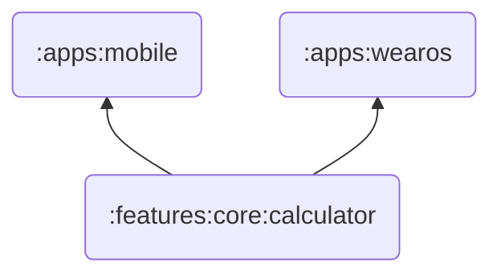

# Mocca

[]()
[](https://opensource.org/licenses/Apache-2.0)
[](https://www.codefactor.io/repository/github/marlonlom/mocca/overview/main)


Android application for mobile phones and smartwatches, that showcases money transfers cost calculation based in [Efecty](https://www.efecty.com.co/web/giros-nacionales) related calculator feature.

# Features

**Mocca** shows an user interface for doing money transfers cost calculation, adding an amount to be sent in Efecty transfers and reviewing the calculation results, or the calculation error based on negative amounts and valid range values.

## Screenshots


## Application modules

**Mocca** contain the following application modules:



| Module                      | Description                                                               |
|-----------------------------|---------------------------------------------------------------------------|
| `:features:core:calculator` | Core money transfers cost calculation implementation                      |
| `:apps:mobile`              | Contains the user interface applied to Android mobile phones and tablets. |
| `:apps:wearos`              | Contains the user interface applied to WearOS smartwatches.               |

## Architecture

**Mocca** is based on the MVVM architecture and the Repository pattern, which follows the [Google's official architecture guidance](https://developer.android.com/topic/architecture).

In detail, the app, specially the mobile app, it contains the following defined features:

| Application feature | Description                                                                                                                                        |
|---------------------|----------------------------------------------------------------------------------------------------------------------------------------------------|
| Calculator          | Contains the UI for the money order cost calculator. Also, the calculation ui state for having a clean usage of the calculation input and outputs. |
| Settings            | Includes the listing and modifications for the following settings: Dark theme, Dynamic colors                                                      |

Both modules described here follows the convention for the already known layers that mvvm pattern include.

```
/* Calculator */
[UI] -> [ViewModel]  // with UI state: CalculatorUiState <- {Empty, WithFailure, WithSuccess}

/* Settings */
[UI] -> [ViewModel] -> [Repository] -> [Datastore]  // with UI state: UserPreferences

```


### WearOS

For the WearOS application module, you have the calculator functionality as a single module. which contains, in a simplified way, the calculator function already described.
In the ui design aspect, the material design current implementation (the compose-material library for wearos) works fine, but, in the future, it will be applied the `material3` implementation for wearos whet it gets available.

## Used Open-source libraries


| Category                     | Dependency                                     |
| ---------------------------- | ---------------------------------------------- |
| **Core Android Components** | androidx.activity:activity-compose:1.10.1       |
|                              | androidx.appcompat:appcompat:1.7.0             |
|                              | androidx.browser:browser:1.8.0                 |
|                              | androidx.core:core-ktx:1.15.0                  |
|                              | androidx.core:core-splashscreen:1.2.0-beta01   |
|                              | androidx.datastore:datastore-preferences:1.1.3 |
|                              | androidx.lifecycle:lifecycle-runtime-compose:2.8.7 |
|                              | androidx.lifecycle:lifecycle-runtime-ktx:2.8.7   |
|                              | androidx.lifecycle:lifecycle-viewmodel-compose:2.8.7 |
|                              | androidx.navigation:navigation-runtime-ktx:2.8.8 |
|                              | androidx.window:window:1.3.0                     |
| **Jetpack Compose** | androidx.compose:compose-bom:2025.02.00 (BOM)  |
|                              | androidx.compose.material:material-icons-extended |
|                              | androidx.compose.material3:material3           |
|                              | androidx.compose.material3:material3-window-size-class |
|                              | androidx.compose.ui:ui                          |
|                              | androidx.compose.ui:ui-text-google-fonts       |
|                              | androidx.compose.ui:ui-graphics                |
|                              | androidx.compose.ui:ui-test-manifest           |
|                              | androidx.compose.ui:ui-tooling                 |
|                              | androidx.compose.ui:ui-tooling-preview         |
|                              | androidx.compose.ui:ui-test-junit4             |
|                              | androidx.navigation:navigation-compose        |
| **Testing** | junit:junit:4.13.2                            |
|                              | org.jetbrains.kotlinx:kotlinx-coroutines-test:1.10.1 |
|                              | androidx.test.ext:junit:1.2.1                  |
|                              | androidx.test.espresso:espresso-core:3.6.1      |
|                              | androidx.window:window-testing:1.3.0            |
|                              | com.google.truth:truth:1.4.4                   |
| **Wear OS** | com.google.android.gms:play-services-wearable:19.0.0 |
|                              | androidx.wear.compose:compose-foundation:1.4.1   |
|                              | androidx.wear.compose:compose-material3:1.0.0-alpha33 |
|                              | androidx.wear.compose:compose-navigation:1.4.1  |
| **Macrobenchmark** | androidx.test.uiautomator:uiautomator:2.3.0     |
|                              | androidx.benchmark:benchmark-macro-junit4:1.3.3 |
| **Other** | com.google.android.gms:play-services-oss-licenses:17.1.0 |
|                              | com.google.android.gms:oss-licenses-plugin:0.10.6 |
|                              | com.jakewharton.timber:timber:5.0.1             |


# Documentation

## Code-of-Conduct

See the [code of conduct](CODE_OF_CONDUCT.md) document for more information.

## Contributing

See the [Contributing](CONTRIBUTING.md) document for more information.

<hr/>

# License

This application is distributed under the terms of the Apache License (Version 2.0). See the [license](LICENSE) for more
information.

```
Copyright 2023 Marlonlom

Licensed under the Apache License, Version 2.0 (the "License");
you may not use this file except in compliance with the License.
You may obtain a copy of the License at

    https://www.apache.org/licenses/LICENSE-2.0

Unless required by applicable law or agreed to in writing, software
distributed under the License is distributed on an "AS IS" BASIS,
WITHOUT WARRANTIES OR CONDITIONS OF ANY KIND, either express or implied.
See the License for the specific language governing permissions and
limitations under the License.
```
