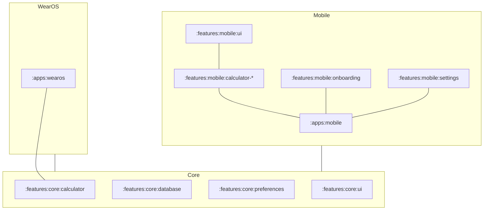

# 💰 Mocca

<div align="center">
  <a href="https://opensource.org/licenses/Apache-2.0"></a>
  <a href="https://android-arsenal.com/api?level=33"></a>
  
  
  <a href="https://www.codefactor.io/repository/github/marlonlom/mocca/overview/main"></a>
</div>

**Mocca** is a modern Android application for mobile and Wear OS that simplifies money transfer cost calculations. Based on [Efecty](https://www.efecty.com.co/web/giros-nacionales) rates, it provides a clean, fast, and reliable way to calculate fees and total costs on the go.

## ✨ Features
- 💰 **Smart Calculator**: Real-time fee calculation with range validation.
- 🕒 **History**: Keep track of your successful calculations locally.
- ⌚ **Wear OS Support**: A streamlined version optimized for your wrist.
- 🎨 **Material 3**: Full support for Dynamic Colors and Adaptive Layouts.
- 🌓 **Theme Support**: Seamless switching between Light and Dark modes.

## 📸 Screenshots
<div align="center">
  
</div>

## 🏗 Architecture
The project is built using modern Android development standards:
- **Pattern**: MVVM (Model-View-ViewModel) + UDF (Unidirectional Data Flow).
- **Modularization**: Feature-based modular structure for high scalability.
- **Concurrency**: Kotlin Coroutines and Flow for reactive data streams.


```mermaid
flowchart BT
    subgraph Core
        fcc[":features:core:calculator"]
        fcd[":features:core:database"]
        fcp[":features:core:preferences"]
        fcu[":features:core:ui"]
    end
    subgraph Mobile
        fmc[":features:mobile:calculator-*"]
        fmo[":features:mobile:onboarding"]
        fms[":features:mobile:settings"]
        fmu[":features:mobile:ui"]
        appm[":apps:mobile"]
    end
    subgraph WearOS
        appw[":apps:wearos"]
    end
    Core --- Mobile
    Core --- WearOS
    fmu --- fmc
    fmc --- appm
    fmo --- appm
    fms --- appm
    fcc --- appw
```

## 🛠 Tech Stack
The application is built with the following cutting-edge technologies:

- **Language**: [Kotlin](https://kotlinlang.org/) `2.3.21`
- **UI Framework**: [Jetpack Compose BOM](https://developer.android.com/jetpack/compose) `2026.05.01`
- **Dependency Injection**: [Koin BOM](https://insert-koin.io/) `4.2.1`
- **Navigation**: [Jetpack Navigation](https://developer.android.com/guide/navigation) `2.9.8`
- **Local Database**: [Room](https://developer.android.com/training/data-storage/room) `2.8.4`
- **Data Storage**: [DataStore](https://developer.android.com/topic/libraries/architecture/datastore) `1.3.0-alpha09`
- **Adaptive Layouts**: [Material 3 Adaptive](https://developer.android.com/develop/ui/compose/layouts/adaptive) `1.2.0`
- **Wear OS**: [Compose for Wear OS](https://developer.android.com/training/wearables/compose) `1.6.2`
- **Infrastructure**: [Android Gradle Plugin](https://developer.android.com/studio/releases/gradle-plugin) `9.2.1`

## 📂 Project Structure
- `apps/`: Main entry points for `:mobile` and `:wearos`.
- `features/mobile/`: UI modules like `:calculator-input`, `:calculator-output`, and `:settings`.
- `features/core/`: Shared business logic, `:calculator` rules, and `:database` persistence.
- `benchmarks/`: Macrobenchmark tests for performance monitoring.

## 🚀 Getting Started
1. Clone the repo: `git clone https://github.com/marlonlom/mocca.git`
2. Open in **Android Studio Ladybug** (or later).
3. Sync Gradle and run the `:apps:mobile` or `:apps:wearos` module.

## 🤝 Documentation
- [Contributing](CONTRIBUTING.md): Guidelines for contributing to the project.
- [Code of Conduct](CODE_OF_CONDUCT.md): Community standards and expectations.

## 📄 License

```
Copyright 2023 Marlonlom

Licensed under the Apache License, Version 2.0 (the "License");
you may not use this file except in compliance with the License.
You may obtain a copy of the License at

    https://www.apache.org/licenses/LICENSE-2.0

Unless required by applicable law or agreed to in writing, software
distributed under the License is distributed on an "AS IS" BASIS,
WITHOUT WARRANTIES OR CONDITIONS OF ANY KIND, either express or implied.
See the License for the specific language governing permissions and
limitations under the License.
```
